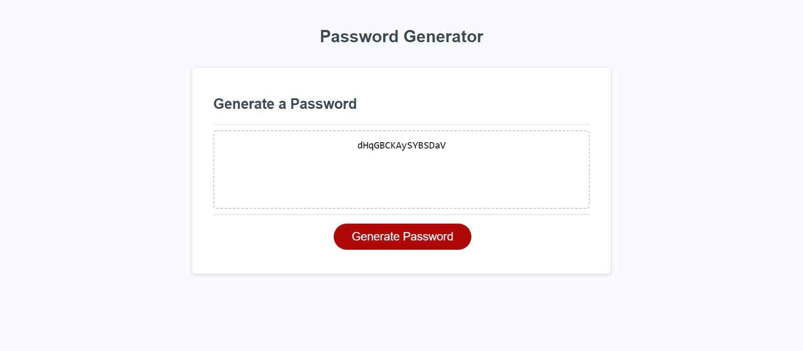

# Password Generator

## Function of page
* When "Generate Password" button is pushed a series of prompts are displayed.
1. Prompt asking how long password should be.
2. Ask to include lowercase characters.
3. Ask to include uppercase characters.
4. Ask to include special characters.
5. Ask to include numeric characters.
* After all prompts are answered a random password is displayed in the box the meets prompted criteria.

### Current Page Issues

* Password does not generate if anything other than a number is entered when asking for password length.

### Link

[Deployed application](https://corycalaway.github.io/password-generator/)

### Webpage

